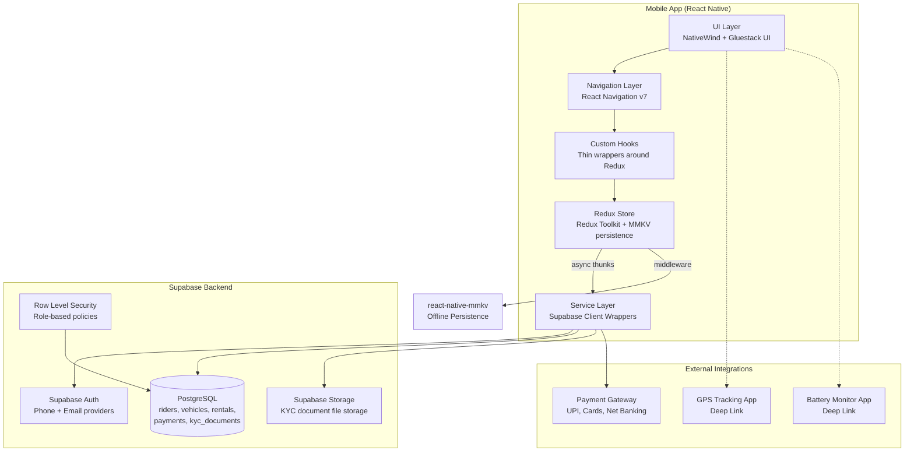
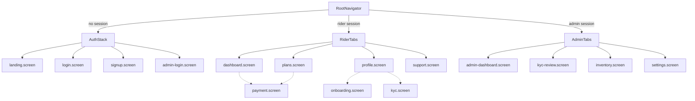

# Design Document — MyWheels EV Rental Platform

## Overview

This document describes the technical design for the MyWheels EV React Native mobile application — an electric two-wheeler rental platform for delivery partners and commuters in Hyderabad. The app converts an existing web SPA into a mobile experience using React Native 0.84 with Expo 55, NativeWind v5 for styling, Gluestack UI v5 for components, React Navigation v7 for routing, Supabase for the entire backend (auth, PostgreSQL database, file storage via Supabase Storage, real-time), and Redux Toolkit for global state management with react-native-mmkv for offline persistence.

The website source repository at [github.com/karan-singare/mywheels-ev](https://github.com/karan-singare/mywheels-ev) serves as the canonical reference for brand assets, design language, color palette, typography, and content structure.

The application is developed across four phases:
1. Landing experience and authentication (rider + admin)
2. Rider onboarding, KYC verification, and document upload
3. Rental plans, payment processing, and rider dashboard
4. GPS tracking, battery monitoring, inventory management, and admin dashboard

The design prioritizes faithful reproduction of the web brand identity (colors, typography, content), role-based navigation, Supabase-native patterns (RLS, auth hooks, storage buckets), Redux-driven state management with offline persistence, and a clean separation between presentation, state, and data layers.

### File Naming Convention

All source files use lowercase hyphen-separated names with a type suffix:

| Suffix | Purpose | Example |
|--------|---------|---------|
| `.component.tsx` | React components | `pricing-card.component.tsx` |
| `.screen.tsx` | Screen components | `login.screen.tsx` |
| `.enum.ts` | Enum/union type definitions | `kyc-status.enum.ts` |
| `.service.ts` | Supabase client wrappers | `auth.service.ts` |
| `.hook.ts` | Custom React hooks | `use-auth.hook.ts` |
| `.type.ts` | TypeScript interfaces/types | `rider.type.ts` |
| `.util.ts` | Utility functions | `validators.util.ts` |
| `.constant.ts` | Static data/constants | `landing-data.constant.ts` |
| `.slice.ts` | Redux Toolkit slices | `auth.slice.ts` |
| `.thunk.ts` | Redux async thunks | `auth.thunk.ts` |
| `.middleware.ts` | Redux middleware | `mmkv-persistence.middleware.ts` |

## Architecture

### High-Level Architecture



### Project Directory Structure

```
src/
├── app/
│   └── app.component.tsx              # Root component with providers
├── config/
│   ├── supabase.constant.ts           # Supabase client initialization
│   ├── theme.constant.ts              # Brand colors, typography tokens
│   └── gluestack-ui.config.ts         # Gluestack UI theme configuration
├── navigation/
│   ├── root-navigator.component.tsx   # Conditional auth/rider/admin routing
│   ├── auth-stack.component.tsx       # Landing → Login → Signup screens
│   ├── rider-tabs.component.tsx       # Bottom tabs: Home, Plans, Profile, Support
│   └── admin-tabs.component.tsx       # Bottom tabs: Dashboard, KYC, Inventory, Settings
├── screens/
│   ├── landing/
│   │   └── landing.screen.tsx
│   ├── auth/
│   │   ├── login.screen.tsx
│   │   ├── signup.screen.tsx
│   │   └── admin-login.screen.tsx
│   ├── onboarding/
│   │   └── onboarding.screen.tsx
│   ├── kyc/
│   │   ├── kyc.screen.tsx
│   │   └── document-uploader.component.tsx
│   ├── rider/
│   │   ├── dashboard.screen.tsx
│   │   ├── plans.screen.tsx
│   │   ├── payment.screen.tsx
│   │   ├── profile.screen.tsx
│   │   └── support.screen.tsx
│   └── admin/
│       ├── admin-dashboard.screen.tsx
│       ├── kyc-review.screen.tsx
│       ├── inventory.screen.tsx
│       └── settings.screen.tsx
├── components/
│   ├── landing/
│   │   ├── hero-section.component.tsx
│   │   ├── trust-section.component.tsx
│   │   ├── about-section.component.tsx
│   │   ├── why-electric-section.component.tsx
│   │   ├── how-it-works-section.component.tsx
│   │   ├── earnings-comparison-section.component.tsx
│   │   ├── pricing-section.component.tsx
│   │   ├── testimonials-section.component.tsx
│   │   ├── faq-section.component.tsx
│   │   ├── contact-section.component.tsx
│   │   └── cta-strip-section.component.tsx
│   ├── shared/
│   │   ├── pricing-card.component.tsx
│   │   ├── section-wrapper.component.tsx
│   │   ├── floating-whatsapp.component.tsx
│   │   └── loading-spinner.component.tsx
│   └── forms/
│       ├── phone-input.component.tsx
│       └── document-picker.component.tsx
├── store/
│   ├── index.ts                       # configureStore, root reducer, typed hooks
│   ├── slices/
│   │   ├── auth.slice.ts
│   │   ├── rider.slice.ts
│   │   ├── kyc.slice.ts
│   │   ├── rentals.slice.ts
│   │   ├── vehicles.slice.ts
│   │   └── payments.slice.ts
│   ├── thunks/
│   │   ├── auth.thunk.ts
│   │   ├── rider.thunk.ts
│   │   ├── kyc.thunk.ts
│   │   ├── rentals.thunk.ts
│   │   ├── vehicles.thunk.ts
│   │   └── payments.thunk.ts
│   └── middleware/
│       └── mmkv-persistence.middleware.ts
├── hooks/
│   ├── use-auth.hook.ts               # Thin wrapper: useSelector + dispatch
│   ├── use-rider.hook.ts
│   ├── use-kyc.hook.ts
│   ├── use-rentals.hook.ts
│   ├── use-vehicles.hook.ts
│   └── use-payments.hook.ts
├── services/
│   ├── auth.service.ts
│   ├── rider.service.ts
│   ├── kyc.service.ts
│   ├── rental.service.ts
│   ├── vehicle.service.ts
│   ├── payment.service.ts
│   └── storage.service.ts            # Supabase Storage upload/download
├── types/
│   ├── rider.type.ts
│   ├── kyc.type.ts
│   ├── vehicle.type.ts
│   ├── rental.type.ts
│   ├── payment.type.ts
│   └── navigation.type.ts
├── enums/
│   ├── kyc-status.enum.ts
│   ├── vehicle-status.enum.ts
│   ├── rental-status.enum.ts
│   ├── payment-status.enum.ts
│   ├── payment-method.enum.ts
│   ├── plan-type.enum.ts
│   ├── user-role.enum.ts
│   ├── onboarding-step.enum.ts
│   └── gender.enum.ts
├── utils/
│   ├── validators.util.ts
│   ├── formatters.util.ts
│   └── deeplink.util.ts
└── constants/
    ├── landing-data.constant.ts
    └── plans.constant.ts
```


### Navigation Architecture



The `root-navigator.component.tsx` reads the Supabase session on mount and subscribes to `onAuthStateChange`. It checks the `user_roles` table to determine if the authenticated user is a rider or admin, then renders the appropriate tab navigator.


## Components and Interfaces

### Navigation Components

**root-navigator.component.tsx** — Conditional root that checks auth state and user role:
```typescript
// Pseudocode for navigation logic
type AuthState = 'loading' | 'unauthenticated' | 'rider' | 'admin';

function RootNavigator() {
  const authState = useAuth(); // thin wrapper around Redux auth slice
  switch (authState) {
    case 'loading': return <SplashScreen />;
    case 'unauthenticated': return <AuthStack />;
    case 'rider': return <RiderTabs />;
    case 'admin': return <AdminTabs />;
  }
}
```

**rider-tabs.component.tsx** — Bottom tab navigator:
| Tab | Icon | Screen | Badge |
|-----|------|--------|-------|
| Home | `Home` | dashboard.screen | Renewal reminder count |
| Plans | `CreditCard` | plans.screen | — |
| Profile | `User` | profile.screen | KYC status indicator |
| Support | `MessageCircle` | support.screen | — |

**admin-tabs.component.tsx** — Bottom tab navigator:
| Tab | Icon | Screen | Badge |
|-----|------|--------|-------|
| Dashboard | `LayoutDashboard` | admin-dashboard.screen | — |
| KYC Review | `FileCheck` | kyc-review.screen | Pending review count |
| Inventory | `Bike` | inventory.screen | — |
| Settings | `Settings` | settings.screen | — |

Icons sourced from `lucide-react-native`.

### Landing Page Components

The landing screen is a single `ScrollView` composed of section components that mirror the web SPA layout. Each section component is self-contained with its own static data imported from `constants/landing-data.constant.ts`.

| Component | Web Equivalent | Key Props | Notes |
|-----------|---------------|-----------|-------|
| `hero-section.component.tsx` | Hero.tsx | — | Gradient overlay, animated text, CTA buttons |
| `trust-section.component.tsx` | TrustSection.tsx | — | Brand name pills (Swiggy, Zomato, etc.) |
| `about-section.component.tsx` | About.tsx | — | 3 feature cards in horizontal scroll on mobile |
| `why-electric-section.component.tsx` | WhyElectric.tsx | — | Stats card + bullet list |
| `how-it-works-section.component.tsx` | HowItWorks.tsx | — | 5-step horizontal stepper |
| `earnings-comparison-section.component.tsx` | EarningsComparison.tsx | — | Side-by-side fuel vs EV cards |
| `pricing-section.component.tsx` | PricingCard.tsx (×3) | — | 3 plan cards, monthly featured |
| `testimonials-section.component.tsx` | Testimonials.tsx | — | 3 testimonial cards |
| `faq-section.component.tsx` | FAQ.tsx | — | Expandable accordion |
| `contact-section.component.tsx` | ContactUs.tsx | — | Contact cards + WhatsApp CTA |
| `cta-strip-section.component.tsx` | CTAStrip.tsx | — | Final CTA with gradient bg |

### Shared Components

**pricing-card.component.tsx** — Reusable across landing and plans screen:
```typescript
interface PricingCardProps {
  title: string;
  price: string;
  period: string;
  features: string[];
  featured?: boolean;
  tag?: string;
  onSelect?: () => void; // undefined on landing (shows phone CTA), defined on plans screen
}
```

**section-wrapper.component.tsx** — Consistent section layout:
```typescript
interface SectionWrapperProps {
  title?: string;
  subtitle?: string;
  variant?: 'default' | 'light' | 'tint';
  children: React.ReactNode;
}
```

**floating-whatsapp.component.tsx** — Persistent floating button:
```typescript
// Opens wa.me/919121969734 with pre-filled message
// Positioned bottom-right with Reanimated entrance animation
```

### Form Components

**phone-input.component.tsx** — Indian mobile number input with validation:
```typescript
interface PhoneInputProps {
  value: string;
  onChangeText: (text: string) => void;
  error?: string;
  label?: string;
}
// Prefixes +91, validates 10-digit format, numeric keyboard
```

**document-picker.component.tsx** — Camera/gallery document capture:
```typescript
interface DocumentPickerProps {
  label: string;
  documentType: 'aadhaar' | 'driving_license' | 'photo' | 'address_proof';
  imageUri?: string;
  onImageSelected: (uri: string) => void;
  onRemove: () => void;
}
// Shows camera/gallery action sheet, displays preview thumbnail
```

### Service Layer Interfaces

```typescript
// auth.service.ts
interface AuthService {
  signUpWithPhone(phone: string, password: string): Promise<AuthResponse>;
  signInWithPhone(phone: string, password: string): Promise<AuthResponse>;
  signInWithEmail(email: string, password: string): Promise<AuthResponse>;
  signOut(): Promise<void>;
  getSession(): Promise<Session | null>;
  onAuthStateChange(callback: (session: Session | null) => void): Subscription;
  refreshSession(): Promise<Session | null>;
}

// rider.service.ts
interface RiderService {
  createProfile(userId: string, data: RiderProfileInput): Promise<RiderProfile>;
  getProfile(userId: string): Promise<RiderProfile | null>;
  updateProfile(userId: string, data: Partial<RiderProfileInput>): Promise<RiderProfile>;
  getOnboardingProgress(userId: string): Promise<OnboardingStep>;
}

// kyc.service.ts — uses Supabase Storage for file uploads
interface KYCService {
  uploadDocument(riderId: string, type: KYCDocumentType, fileUri: string): Promise<KYCDocument>;
  getDocuments(riderId: string): Promise<KYCDocument[]>;
  getKYCStatus(riderId: string): Promise<KYCStatus>;
  submitForReview(riderId: string): Promise<void>;
  approveKYC(riderId: string, adminId: string): Promise<void>;
  rejectKYC(riderId: string, adminId: string, reason: string): Promise<void>;
  getPendingReviews(): Promise<KYCReviewItem[]>;
}

// rental.service.ts
interface RentalService {
  createRental(riderId: string, planId: string, vehicleId: string): Promise<Rental>;
  getActiveRental(riderId: string): Promise<Rental | null>;
  getRentalHistory(riderId: string): Promise<Rental[]>;
  getAllActiveRentals(): Promise<Rental[]>; // admin only
}

// vehicle.service.ts
interface VehicleService {
  addVehicle(data: VehicleInput): Promise<Vehicle>;
  getVehicles(filter?: VehicleStatus): Promise<Vehicle[]>;
  getVehicle(vehicleId: string): Promise<Vehicle | null>;
  assignVehicle(vehicleId: string, riderId: string): Promise<Vehicle>;
  updateStatus(vehicleId: string, status: VehicleStatus, reason?: string): Promise<Vehicle>;
  getStatusCounts(): Promise<Record<VehicleStatus, number>>;
}

// payment.service.ts
interface PaymentService {
  initiatePayment(riderId: string, planId: string, method: PaymentMethod): Promise<PaymentIntent>;
  confirmPayment(paymentId: string, gatewayResponse: unknown): Promise<Payment>;
  getPaymentHistory(riderId: string): Promise<Payment[]>;
  getReceipt(paymentId: string): Promise<PaymentReceipt>;
  getAllPayments(): Promise<Payment[]>; // admin only
}

// storage.service.ts — wraps Supabase Storage (the file storage service within Supabase)
interface StorageService {
  uploadImage(bucket: string, path: string, fileUri: string): Promise<string>; // returns public URL
  getSignedUrl(bucket: string, path: string): Promise<string>;
  deleteFile(bucket: string, path: string): Promise<void>;
}
```

### Hook Interfaces

Hooks are thin wrappers around Redux selectors and dispatch. They provide a convenient API for components while keeping all state logic in Redux slices and thunks.

```typescript
// use-auth.hook.ts
function useAuth(): {
  session: Session | null;
  user: User | null;
  role: 'rider' | 'admin' | null;
  loading: boolean;
  error: string | null;
  signUp: (phone: string, password: string) => void;   // dispatches auth thunk
  signIn: (phone: string, password: string) => void;    // dispatches auth thunk
  adminSignIn: (email: string, password: string) => void;
  signOut: () => void;
}

// use-rider.hook.ts
function useRider(): {
  profile: RiderProfile | null;
  loading: boolean;
  error: string | null;
  onboardingStep: OnboardingStep;
  updateProfile: (data: Partial<RiderProfileInput>) => void; // dispatches rider thunk
}

// use-kyc.hook.ts
function useKYC(): {
  status: KYCStatus;
  documents: KYCDocument[];
  loading: boolean;
  error: string | null;
  pendingCount: number;
  uploadDocument: (type: KYCDocumentType, uri: string) => void;
  submitForReview: () => void;
}
```


## Redux Store

The application uses Redux Toolkit for global state management. All async operations (Supabase calls) use `createAsyncThunk`. Redux state is persisted to `react-native-mmkv` via custom middleware for offline support.

### Store Configuration

```typescript
// store/index.ts
import { configureStore } from '@reduxjs/toolkit';
import { useDispatch, useSelector, TypedUseSelectorHook } from 'react-redux';
import { mmkvPersistenceMiddleware } from './middleware/mmkv-persistence.middleware';
import authReducer from './slices/auth.slice';
import riderReducer from './slices/rider.slice';
import kycReducer from './slices/kyc.slice';
import rentalsReducer from './slices/rentals.slice';
import vehiclesReducer from './slices/vehicles.slice';
import paymentsReducer from './slices/payments.slice';

export const store = configureStore({
  reducer: {
    auth: authReducer,
    rider: riderReducer,
    kyc: kycReducer,
    rentals: rentalsReducer,
    vehicles: vehiclesReducer,
    payments: paymentsReducer,
  },
  middleware: (getDefaultMiddleware) =>
    getDefaultMiddleware({ serializableCheck: false })
      .concat(mmkvPersistenceMiddleware),
});

export type RootState = ReturnType<typeof store.getState>;
export type AppDispatch = typeof store.dispatch;
export const useAppDispatch = () => useDispatch<AppDispatch>();
export const useAppSelector: TypedUseSelectorHook<RootState> = useSelector;
```

### Slices

Each slice manages a domain of the application state. Slices handle `createAsyncThunk` lifecycle actions (pending, fulfilled, rejected) for loading/error states.

**auth.slice.ts** — Authentication state:
```typescript
interface AuthState {
  session: Session | null;
  user: User | null;
  role: UserRole | null;
  loading: boolean;
  error: string | null;
}
// Handles: signUp, signIn, adminSignIn, signOut, restoreSession thunks
// Listens to onAuthStateChange via a thunk that dispatches session updates
```

**rider.slice.ts** — Rider profile and onboarding:
```typescript
interface RiderState {
  profile: RiderProfile | null;
  onboardingStep: OnboardingStep;
  loading: boolean;
  error: string | null;
}
// Handles: fetchProfile, createProfile, updateProfile thunks
```

**kyc.slice.ts** — KYC documents and review status:
```typescript
interface KYCState {
  status: KYCStatus;
  documents: KYCDocument[];
  pendingReviews: KYCReviewItem[];  // admin only
  pendingCount: number;
  loading: boolean;
  error: string | null;
}
// Handles: fetchDocuments, uploadDocument, submitForReview, approveKYC, rejectKYC thunks
```

**rentals.slice.ts** — Rental records:
```typescript
interface RentalsState {
  activeRental: Rental | null;
  history: Rental[];
  allActive: Rental[];  // admin only
  loading: boolean;
  error: string | null;
}
// Handles: fetchActiveRental, fetchHistory, createRental, fetchAllActive thunks
```

**vehicles.slice.ts** — Vehicle inventory:
```typescript
interface VehiclesState {
  vehicles: Vehicle[];
  statusCounts: Record<VehicleStatus, number>;
  currentFilter: VehicleStatus | 'all';
  loading: boolean;
  error: string | null;
}
// Handles: fetchVehicles, addVehicle, assignVehicle, updateVehicleStatus thunks
```

**payments.slice.ts** — Payment records:
```typescript
interface PaymentsState {
  payments: Payment[];
  currentReceipt: PaymentReceipt | null;
  loading: boolean;
  error: string | null;
}
// Handles: initiatePayment, confirmPayment, fetchHistory, fetchReceipt thunks
```

### Async Thunks

Each thunk file exports `createAsyncThunk` actions that call the corresponding service layer. Example:

```typescript
// store/thunks/auth.thunk.ts
import { createAsyncThunk } from '@reduxjs/toolkit';
import * as authService from '../../services/auth.service';

export const signIn = createAsyncThunk(
  'auth/signIn',
  async ({ phone, password }: { phone: string; password: string }, { rejectWithValue }) => {
    try {
      const response = await authService.signInWithPhone(phone, password);
      return response;
    } catch (error) {
      return rejectWithValue((error as Error).message);
    }
  }
);

export const signUp = createAsyncThunk('auth/signUp', async (...) => { ... });
export const adminSignIn = createAsyncThunk('auth/adminSignIn', async (...) => { ... });
export const signOut = createAsyncThunk('auth/signOut', async (...) => { ... });
export const restoreSession = createAsyncThunk('auth/restoreSession', async (...) => { ... });
```

### MMKV Persistence Middleware

```typescript
// store/middleware/mmkv-persistence.middleware.ts
import { MMKV } from 'react-native-mmkv';
import { Middleware } from '@reduxjs/toolkit';

const storage = new MMKV();

// Persists selected slices to MMKV on every state change.
// On app launch, the store is rehydrated from MMKV before Supabase calls complete,
// providing instant offline access to cached data.
//
// Persisted slices: auth (session token), rider (profile), kyc (status/documents),
// rentals (active rental), vehicles (last known list).
// payments slice is NOT persisted (always fetched fresh).

export const mmkvPersistenceMiddleware: Middleware = (store) => (next) => (action) => {
  const result = next(action);
  const state = store.getState();

  // Persist selected slices
  const slicesToPersist = ['auth', 'rider', 'kyc', 'rentals', 'vehicles'];
  for (const key of slicesToPersist) {
    storage.set(`redux_${key}`, JSON.stringify(state[key]));
  }

  return result;
};

// Rehydration helper — called once at app startup before store creation
export function getPersistedState(): Partial<RootState> {
  const preloaded: Record<string, unknown> = {};
  const slices = ['auth', 'rider', 'kyc', 'rentals', 'vehicles'];
  for (const key of slices) {
    const raw = storage.getString(`redux_${key}`);
    if (raw) preloaded[key] = JSON.parse(raw);
  }
  return preloaded as Partial<RootState>;
}
```

### Hook → Redux Mapping

Hooks are thin wrappers that expose Redux state and dispatch thunks. Components import hooks, not Redux directly.

```typescript
// hooks/use-auth.hook.ts
import { useAppSelector, useAppDispatch } from '../store';
import { signIn, signUp, adminSignIn, signOut } from '../store/thunks/auth.thunk';

export function useAuth() {
  const dispatch = useAppDispatch();
  const { session, user, role, loading, error } = useAppSelector((s) => s.auth);

  return {
    session, user, role, loading, error,
    signIn: (phone: string, password: string) => dispatch(signIn({ phone, password })),
    signUp: (phone: string, password: string) => dispatch(signUp({ phone, password })),
    adminSignIn: (email: string, password: string) => dispatch(adminSignIn({ email, password })),
    signOut: () => dispatch(signOut()),
  };
}
```

## Data Models

### Enum Definitions

Each enum is defined in its own file under `src/enums/`:

```typescript
// enums/kyc-status.enum.ts
export type KYCStatus = 'not_started' | 'in_progress' | 'under_review' | 'approved' | 'rejected';

// enums/kyc-document-type.enum.ts
export type KYCDocumentType = 'aadhaar' | 'driving_license' | 'photo' | 'address_proof';

// enums/vehicle-status.enum.ts
export type VehicleStatus = 'available' | 'rented' | 'maintenance';

// enums/rental-status.enum.ts
export type RentalStatus = 'active' | 'expired' | 'cancelled';

// enums/payment-status.enum.ts
export type PaymentStatus = 'pending' | 'success' | 'failed';

// enums/payment-method.enum.ts
export type PaymentMethod = 'upi' | 'debit_card' | 'credit_card' | 'net_banking';

// enums/plan-type.enum.ts
export type PlanType = 'daily' | 'weekly' | 'monthly';

// enums/user-role.enum.ts
export type UserRole = 'rider' | 'admin';

// enums/onboarding-step.enum.ts
export type OnboardingStep = 'personal_info' | 'address' | 'emergency_contact' | 'completed';

// enums/gender.enum.ts
export type Gender = 'male' | 'female' | 'other';
```

### Type Definitions

Each domain model is defined in its own file under `src/types/`:

```typescript
// types/rider.type.ts
import { KYCStatus } from '../enums/kyc-status.enum';
import { OnboardingStep } from '../enums/onboarding-step.enum';
import { Gender } from '../enums/gender.enum';

export interface UserRoleRecord {
  id: string;
  role: 'rider' | 'admin';
  created_at: string;
}

export interface RiderProfile {
  id: string;
  user_id: string;
  full_name: string;
  phone: string;
  date_of_birth: string;
  gender: Gender;
  address: string;
  city: string;
  emergency_contact: string;
  kyc_status: KYCStatus;
  onboarding_step: OnboardingStep;
  profile_completion: number;
  created_at: string;
  updated_at: string;
}

export interface RiderProfileInput {
  full_name: string;
  phone: string;
  date_of_birth: string;
  gender: Gender;
  address: string;
  city: string;
  emergency_contact: string;
}
```

```typescript
// types/kyc.type.ts
import { KYCDocumentType } from '../enums/kyc-document-type.enum';
import { KYCStatus } from '../enums/kyc-status.enum';

export interface KYCDocument {
  id: string;
  rider_id: string;
  document_type: KYCDocumentType;
  file_path: string;       // Supabase Storage path
  file_url: string;        // Signed URL (transient)
  uploaded_at: string;
}

export interface KYCReview {
  id: string;
  rider_id: string;
  reviewed_by: string | null;
  status: KYCStatus;
  rejection_reason: string | null;
  submitted_at: string;
  reviewed_at: string | null;
}

export interface KYCReviewItem extends KYCReview {
  rider_name: string;
  rider_phone: string;
}
```

```typescript
// types/vehicle.type.ts
import { VehicleStatus } from '../enums/vehicle-status.enum';

export interface Vehicle {
  id: string;
  vehicle_id: string;
  model: string;
  registration_number: string;
  battery_number: string;
  status: VehicleStatus;
  assigned_rider_id: string | null;
  maintenance_reason: string | null;
  last_gps_lat: number | null;
  last_gps_lng: number | null;
  last_gps_timestamp: string | null;
  last_battery_percentage: number | null;
  created_at: string;
  updated_at: string;
}

export interface VehicleInput {
  vehicle_id: string;
  model: string;
  registration_number: string;
  battery_number: string;
}
```

```typescript
// types/rental.type.ts
import { PlanType } from '../enums/plan-type.enum';
import { RentalStatus } from '../enums/rental-status.enum';

export interface RentalPlan {
  id: string;
  type: PlanType;
  name: string;
  price: number;
  period_days: number;
  features: string[];
  featured: boolean;
  tag: string | null;
}

export interface Rental {
  id: string;
  rider_id: string;
  vehicle_id: string;
  plan_id: string;
  plan_type: PlanType;
  start_date: string;
  end_date: string;
  status: RentalStatus;
  amount_paid: number;
  created_at: string;
}
```

```typescript
// types/payment.type.ts
import { PaymentMethod } from '../enums/payment-method.enum';
import { PaymentStatus } from '../enums/payment-status.enum';

export interface Payment {
  id: string;
  rider_id: string;
  rental_id: string | null;
  plan_id: string;
  amount: number;
  payment_method: PaymentMethod;
  status: PaymentStatus;
  gateway_transaction_id: string | null;
  receipt_url: string | null;
  created_at: string;
}

export interface PaymentReceipt {
  payment_id: string;
  rider_name: string;
  plan_name: string;
  amount: number;
  payment_method: PaymentMethod;
  transaction_id: string;
  date: string;
}

export interface PaymentIntent {
  id: string;
  gateway_order_id: string;
  amount: number;
}
```


### Supabase Database Schema (PostgreSQL)

```sql
-- Enable UUID generation
CREATE EXTENSION IF NOT EXISTS "uuid-ossp";

-- User roles table (links auth.users to app roles)
CREATE TABLE user_roles (
  id UUID PRIMARY KEY REFERENCES auth.users(id) ON DELETE CASCADE,
  role TEXT NOT NULL CHECK (role IN ('rider', 'admin')),
  created_at TIMESTAMPTZ DEFAULT NOW()
);

-- Rider profiles
CREATE TABLE riders (
  id UUID PRIMARY KEY DEFAULT uuid_generate_v4(),
  user_id UUID UNIQUE NOT NULL REFERENCES auth.users(id) ON DELETE CASCADE,
  full_name TEXT NOT NULL DEFAULT '',
  phone TEXT NOT NULL DEFAULT '',
  date_of_birth DATE,
  gender TEXT CHECK (gender IN ('male', 'female', 'other')),
  address TEXT NOT NULL DEFAULT '',
  city TEXT NOT NULL DEFAULT 'Hyderabad',
  emergency_contact TEXT NOT NULL DEFAULT '',
  kyc_status TEXT NOT NULL DEFAULT 'not_started'
    CHECK (kyc_status IN ('not_started', 'in_progress', 'under_review', 'approved', 'rejected')),
  onboarding_step TEXT NOT NULL DEFAULT 'personal_info'
    CHECK (onboarding_step IN ('personal_info', 'address', 'emergency_contact', 'completed')),
  profile_completion INTEGER NOT NULL DEFAULT 0 CHECK (profile_completion BETWEEN 0 AND 100),
  created_at TIMESTAMPTZ DEFAULT NOW(),
  updated_at TIMESTAMPTZ DEFAULT NOW()
);

-- KYC documents
CREATE TABLE kyc_documents (
  id UUID PRIMARY KEY DEFAULT uuid_generate_v4(),
  rider_id UUID NOT NULL REFERENCES riders(id) ON DELETE CASCADE,
  document_type TEXT NOT NULL
    CHECK (document_type IN ('aadhaar', 'driving_license', 'photo', 'address_proof')),
  file_path TEXT NOT NULL,
  uploaded_at TIMESTAMPTZ DEFAULT NOW(),
  UNIQUE (rider_id, document_type)  -- one document per type per rider
);

-- KYC reviews
CREATE TABLE kyc_reviews (
  id UUID PRIMARY KEY DEFAULT uuid_generate_v4(),
  rider_id UUID NOT NULL REFERENCES riders(id) ON DELETE CASCADE,
  reviewed_by UUID REFERENCES auth.users(id),
  status TEXT NOT NULL DEFAULT 'under_review'
    CHECK (status IN ('under_review', 'approved', 'rejected')),
  rejection_reason TEXT,
  submitted_at TIMESTAMPTZ DEFAULT NOW(),
  reviewed_at TIMESTAMPTZ
);

-- Rental plans (seed data)
CREATE TABLE rental_plans (
  id UUID PRIMARY KEY DEFAULT uuid_generate_v4(),
  type TEXT NOT NULL CHECK (type IN ('daily', 'weekly', 'monthly')),
  name TEXT NOT NULL,
  price INTEGER NOT NULL,
  period_days INTEGER NOT NULL,
  features JSONB NOT NULL DEFAULT '[]',
  featured BOOLEAN NOT NULL DEFAULT FALSE,
  tag TEXT
);

-- Vehicles
CREATE TABLE vehicles (
  id UUID PRIMARY KEY DEFAULT uuid_generate_v4(),
  vehicle_id TEXT UNIQUE NOT NULL,
  model TEXT NOT NULL,
  registration_number TEXT UNIQUE NOT NULL,
  battery_number TEXT NOT NULL,
  status TEXT NOT NULL DEFAULT 'available'
    CHECK (status IN ('available', 'rented', 'maintenance')),
  assigned_rider_id UUID REFERENCES riders(id),
  maintenance_reason TEXT,
  last_gps_lat DOUBLE PRECISION,
  last_gps_lng DOUBLE PRECISION,
  last_gps_timestamp TIMESTAMPTZ,
  last_battery_percentage INTEGER CHECK (last_battery_percentage BETWEEN 0 AND 100),
  created_at TIMESTAMPTZ DEFAULT NOW(),
  updated_at TIMESTAMPTZ DEFAULT NOW()
);

-- Rentals
CREATE TABLE rentals (
  id UUID PRIMARY KEY DEFAULT uuid_generate_v4(),
  rider_id UUID NOT NULL REFERENCES riders(id),
  vehicle_id UUID NOT NULL REFERENCES vehicles(id),
  plan_id UUID NOT NULL REFERENCES rental_plans(id),
  plan_type TEXT NOT NULL CHECK (plan_type IN ('daily', 'weekly', 'monthly')),
  start_date DATE NOT NULL,
  end_date DATE NOT NULL,
  status TEXT NOT NULL DEFAULT 'active'
    CHECK (status IN ('active', 'expired', 'cancelled')),
  amount_paid INTEGER NOT NULL,
  created_at TIMESTAMPTZ DEFAULT NOW(),
  CHECK (end_date > start_date)
);

-- Payments
CREATE TABLE payments (
  id UUID PRIMARY KEY DEFAULT uuid_generate_v4(),
  rider_id UUID NOT NULL REFERENCES riders(id),
  rental_id UUID REFERENCES rentals(id),
  plan_id UUID NOT NULL REFERENCES rental_plans(id),
  amount INTEGER NOT NULL,
  payment_method TEXT NOT NULL
    CHECK (payment_method IN ('upi', 'debit_card', 'credit_card', 'net_banking')),
  status TEXT NOT NULL DEFAULT 'pending'
    CHECK (status IN ('pending', 'success', 'failed')),
  gateway_transaction_id TEXT,
  receipt_url TEXT,
  created_at TIMESTAMPTZ DEFAULT NOW()
);

-- Indexes for common queries
CREATE INDEX idx_riders_user_id ON riders(user_id);
CREATE INDEX idx_riders_kyc_status ON riders(kyc_status);
CREATE INDEX idx_kyc_documents_rider_id ON kyc_documents(rider_id);
CREATE INDEX idx_vehicles_status ON vehicles(status);
CREATE INDEX idx_vehicles_assigned_rider ON vehicles(assigned_rider_id);
CREATE INDEX idx_rentals_rider_id ON rentals(rider_id);
CREATE INDEX idx_rentals_status ON rentals(status);
CREATE INDEX idx_payments_rider_id ON payments(rider_id);
```

### Row Level Security (RLS) Policies

```sql
-- Enable RLS on all tables
ALTER TABLE user_roles ENABLE ROW LEVEL SECURITY;
ALTER TABLE riders ENABLE ROW LEVEL SECURITY;
ALTER TABLE kyc_documents ENABLE ROW LEVEL SECURITY;
ALTER TABLE kyc_reviews ENABLE ROW LEVEL SECURITY;
ALTER TABLE rental_plans ENABLE ROW LEVEL SECURITY;
ALTER TABLE vehicles ENABLE ROW LEVEL SECURITY;
ALTER TABLE rentals ENABLE ROW LEVEL SECURITY;
ALTER TABLE payments ENABLE ROW LEVEL SECURITY;

-- Helper function: check if current user is admin
CREATE OR REPLACE FUNCTION is_admin()
RETURNS BOOLEAN AS $$
  SELECT EXISTS (
    SELECT 1 FROM user_roles WHERE id = auth.uid() AND role = 'admin'
  );
$$ LANGUAGE sql SECURITY DEFINER;

-- Helper function: get rider id for current user
CREATE OR REPLACE FUNCTION get_rider_id()
RETURNS UUID AS $$
  SELECT id FROM riders WHERE user_id = auth.uid();
$$ LANGUAGE sql SECURITY DEFINER;

-- user_roles: users can read their own role, admins can read all
CREATE POLICY "Users read own role" ON user_roles FOR SELECT USING (id = auth.uid());
CREATE POLICY "Admins read all roles" ON user_roles FOR SELECT USING (is_admin());

-- riders: riders read/update own profile, admins read all
CREATE POLICY "Riders read own profile" ON riders FOR SELECT USING (user_id = auth.uid());
CREATE POLICY "Riders update own profile" ON riders FOR UPDATE USING (user_id = auth.uid());
CREATE POLICY "Riders insert own profile" ON riders FOR INSERT WITH CHECK (user_id = auth.uid());
CREATE POLICY "Admins read all riders" ON riders FOR SELECT USING (is_admin());
CREATE POLICY "Admins update riders" ON riders FOR UPDATE USING (is_admin());

-- kyc_documents: riders manage own docs, admins read all
CREATE POLICY "Riders manage own docs" ON kyc_documents FOR ALL
  USING (rider_id = get_rider_id());
CREATE POLICY "Admins read all docs" ON kyc_documents FOR SELECT USING (is_admin());

-- kyc_reviews: riders read own reviews, admins manage all
CREATE POLICY "Riders read own reviews" ON kyc_reviews FOR SELECT
  USING (rider_id = get_rider_id());
CREATE POLICY "Admins manage reviews" ON kyc_reviews FOR ALL USING (is_admin());

-- rental_plans: everyone can read
CREATE POLICY "Anyone reads plans" ON rental_plans FOR SELECT USING (true);
CREATE POLICY "Admins manage plans" ON rental_plans FOR ALL USING (is_admin());

-- vehicles: admins full access, riders read assigned vehicle only
CREATE POLICY "Admins manage vehicles" ON vehicles FOR ALL USING (is_admin());
CREATE POLICY "Riders read assigned vehicle" ON vehicles FOR SELECT
  USING (assigned_rider_id = get_rider_id());

-- rentals: riders read own, admins read all
CREATE POLICY "Riders read own rentals" ON rentals FOR SELECT
  USING (rider_id = get_rider_id());
CREATE POLICY "Admins manage rentals" ON rentals FOR ALL USING (is_admin());

-- payments: riders read own, admins read all
CREATE POLICY "Riders read own payments" ON payments FOR SELECT
  USING (rider_id = get_rider_id());
CREATE POLICY "Admins manage payments" ON payments FOR ALL USING (is_admin());
```

### Supabase Storage (File Storage)

Supabase Storage is the built-in file storage service within Supabase — it is not a separate external service. It provides S3-compatible object storage managed through the same Supabase project, using the same auth tokens and RLS-like policies. KYC document images are stored in Supabase Storage buckets.

| Bucket | Access | Purpose |
|--------|--------|---------|
| `kyc-documents` | Private (signed URLs) | Aadhaar, DL, photo, address proof images |

Storage policies:
- Riders can upload to `kyc-documents/{rider_id}/` path
- Riders can read their own files only
- Admins can read all files
- Max file size: 10 MB
- Allowed MIME types: `image/jpeg`, `image/png`

The `storage.service.ts` wraps `supabase.storage.from(bucket)` calls for upload, signed URL generation, and deletion. The `kyc.service.ts` uses `storage.service.ts` internally when uploading KYC documents — it uploads the file to Supabase Storage and stores the resulting file path in the `kyc_documents` PostgreSQL table.

### Seed Data — Rental Plans

```sql
INSERT INTO rental_plans (type, name, price, period_days, features, featured, tag) VALUES
  ('daily', 'Daily Plan', 249, 1,
   '["Perfect for trying before committing", "No minimum period required", "Pay as you go flexibility", "Ideal for part-time riders"]',
   false, null),
  ('weekly', 'Weekly Plan', 1499, 7,
   '["Ideal for short-term or trial usage", "7-day rental period", "Great for testing the fit", "No long-term commitment"]',
   false, null),
  ('monthly', 'Monthly Plan', 4999, 30,
   '["Most preferred by delivery partners", "30-day rental period", "Predictable monthly expense", "Priority support included"]',
   true, 'Best for Full-Time Riders');
```

### Brand Design System & Theme Configuration

The brand design system is derived from the MyWheels EV website ([github.com/karan-singare/mywheels-ev](https://github.com/karan-singare/mywheels-ev)). The website's Tailwind config, CSS, and component styles define the canonical color palette, typography, and visual language. See `docs/web-source-reference.md` sections 4 and 10 for the full reference.

#### Color Palette

```typescript
// config/theme.constant.ts
export const colors = {
  primary: '#184cba',     // Main brand blue, buttons, links
  secondary: '#1a70c3',   // Gradient stops
  tertiary: '#2994bf',    // Gradient stops, accents
  dark: '#141c6c',        // Headings, dark backgrounds
  darkAlt: '#1c298b',     // Alternative dark
  teal: '#40b1af',        // Testimonial gradient
  green: '#84d06e',       // CTA buttons, success, accents
  mint: '#61c194',        // Testimonial gradient
  olive: '#7aad4f',       // Reserved
  bg: '#f8fafc',          // Page background
  card: '#ffffff',        // Card backgrounds
  textMain: '#141c6c',    // Main text (headings)
  muted: '#374151',       // Body text
  mutedLight: '#6b7280',  // Secondary/lighter text
  accent: '#84d06e',      // Same as green
  footerBg: '#141c6c',    // Footer background
} as const;
```

#### Typography

```typescript
// Font: Manrope loaded via expo-font or react-native custom fonts
export const fonts = {
  regular: 'Manrope-Regular',    // weight 400
  medium: 'Manrope-Medium',      // weight 500
  semibold: 'Manrope-SemiBold',  // weight 600
  bold: 'Manrope-Bold',          // weight 700
  extrabold: 'Manrope-ExtraBold', // weight 800
} as const;
```

#### NativeWind / Tailwind CSS v4 Theme

The `global.css` file extends the Tailwind theme with the brand color palette and Manrope font family, matching the website's `tailwind.config.js`:

```css
/* global.css — NativeWind v5 / Tailwind CSS v4 theme */
@import "tailwindcss";

@theme {
  --color-primary: #184cba;
  --color-secondary: #1a70c3;
  --color-tertiary: #2994bf;
  --color-dark: #141c6c;
  --color-dark-alt: #1c298b;
  --color-teal: #40b1af;
  --color-green: #84d06e;
  --color-mint: #61c194;
  --color-olive: #7aad4f;
  --color-bg: #f8fafc;
  --color-card: #ffffff;
  --color-text-main: #141c6c;
  --color-muted: #374151;
  --color-muted-light: #6b7280;
  --color-accent: #84d06e;
  --color-footer-bg: #141c6c;

  --font-family-manrope: 'Manrope', sans-serif;
}
```

This enables using `className="bg-primary text-dark font-manrope"` etc. throughout all components via NativeWind.

#### Gluestack UI Theme Configuration

Gluestack UI v5 is configured to use the same brand tokens so that all Gluestack components (Button, Input, Card, etc.) render with the MyWheels EV brand identity:

```typescript
// config/gluestack-ui.config.ts
import { createConfig } from '@gluestack-ui/themed';

export const gluestackConfig = createConfig({
  tokens: {
    colors: {
      primary0: '#e8eef8',
      primary50: '#c5d4f0',
      primary100: '#a1bae8',
      primary200: '#7da0e0',
      primary300: '#5986d8',
      primary400: '#356cd0',
      primary500: '#184cba',   // primary
      primary600: '#143fa0',
      primary700: '#103286',
      primary800: '#0c256c',
      primary900: '#081852',

      secondary500: '#1a70c3', // secondary
      tertiary500: '#2994bf',  // tertiary

      success0: '#f0fbe8',
      success500: '#84d06e',   // green / accent
      success700: '#5a9a3e',

      info500: '#40b1af',      // teal

      backgroundLight0: '#ffffff',   // card
      backgroundLight50: '#f8fafc',  // bg
      backgroundDark900: '#141c6c',  // dark / footerBg

      textLight0: '#ffffff',
      textLight700: '#374151',       // muted (body text)
      textLight900: '#141c6c',       // textMain (headings)
      textLight500: '#6b7280',       // mutedLight
    },
    fonts: {
      heading: 'Manrope',
      body: 'Manrope',
      mono: 'monospace',
    },
  },
});
```

The `app.component.tsx` wraps the app in both `<GluestackUIProvider config={gluestackConfig}>` and the Redux `<Provider store={store}>`.


## Correctness Properties

*A property is a characteristic or behavior that should hold true across all valid executions of a system — essentially, a formal statement about what the system should do. Properties serve as the bridge between human-readable specifications and machine-verifiable correctness guarantees.*

### Property 1: Invalid credentials always produce an error

*For any* phone number and password combination (rider login) or email and password combination (admin login) that does not match a valid account, the authentication service should return an error and not create a session.

**Validates: Requirements 2.5, 3.3**

### Property 2: Role-based navigation routing

*For any* authenticated user, the root navigator should render the rider tab navigator if the user's role is `rider`, the admin tab navigator if the user's role is `admin`, and the auth stack if no valid session exists. No other combinations should be possible.

**Validates: Requirements 3.4, 3.5, 15.1**

### Property 3: Onboarding field validation rejects invalid inputs

*For any* onboarding input where the full name is empty, or the date of birth yields an age less than 18, or a phone number is not a valid 10-digit Indian mobile number, or the address is empty, the onboarding form should prevent progression to the next step.

**Validates: Requirements 4.2**

### Property 4: Onboarding resumes from last completed step

*For any* onboarding step that has been completed and persisted, if the app is closed and reopened, the onboarding flow should resume from the next incomplete step rather than restarting from the beginning.

**Validates: Requirements 4.6**

### Property 5: KYC status display accuracy

*For any* KYC status value in the set {not_started, in_progress, under_review, approved, rejected}, the KYC module should display the corresponding human-readable status string to the rider.

**Validates: Requirements 5.2**

### Property 6: Plan access gated by KYC approval

*For any* KYC status that is not `approved`, the plan selector should be inaccessible to the rider, displaying a message that KYC approval is required.

**Validates: Requirements 5.6**

### Property 7: Document file validation

*For any* file selected for upload, if the file is not JPEG or PNG format, or exceeds 10 MB in size, the document uploader should reject the file and display an appropriate error message.

**Validates: Requirements 6.2**

### Property 8: Document checklist and submit enablement

*For any* subset of the four required KYC document types that have been uploaded, the document checklist should correctly show each document type as either uploaded or pending, and the "Submit for Review" action should be enabled if and only if all four document types have been uploaded.

**Validates: Requirements 6.6, 6.7**

### Property 9: Payment order summary matches selected plan

*For any* rental plan selected by the rider, the payment screen should display an order summary containing the exact plan name, price, and rental period matching the plan definition.

**Validates: Requirements 8.1**

### Property 10: Payment and receipt round-trip

*For any* successful payment, the transaction should be recorded in the database with the correct rider ID, plan ID, amount, payment method, and timestamp, and a receipt should be retrievable containing all these details.

**Validates: Requirements 8.3, 8.6**

### Property 11: Dashboard days remaining computation

*For any* active rental with a known start date and end date, the rider dashboard should correctly compute and display the number of days remaining as `end_date - today`, and this value should never be negative for active rentals.

**Validates: Requirements 9.1**

### Property 12: Dashboard vehicle details display

*For any* rider with an assigned vehicle, the rider dashboard should display the vehicle model, registration number, and vehicle ID matching the vehicle record in the database.

**Validates: Requirements 9.2**

### Property 13: Dashboard profile and KYC status display

*For any* rider profile, the dashboard should display the correct KYC status and a profile completion percentage that accurately reflects the number of completed profile fields.

**Validates: Requirements 9.4**

### Property 14: Renewal reminder threshold

*For any* active rental, if the end date is within 3 days of the current date, the dashboard should display a renewal reminder. If the end date is more than 3 days away, no renewal reminder should be shown.

**Validates: Requirements 9.5**

### Property 15: Vehicle status transitions

*For any* vehicle, adding it should set status to `available` by default. Assigning it to a rider should change status to `rented` and link the rider. Marking it for maintenance should change status to `maintenance` and store the reason. Each transition should correctly update the vehicle record.

**Validates: Requirements 12.2, 12.3, 12.4**

### Property 16: Vehicle inventory filtering and counts

*For any* set of vehicles with mixed statuses, filtering by a specific status should return exactly the vehicles with that status, and the summary count for each status category should equal the actual number of vehicles in that status.

**Validates: Requirements 12.5, 12.6**

### Property 17: Admin summary card accuracy

*For any* database state, the admin dashboard summary cards should display counts (total riders, active rentals, available vehicles, maintenance vehicles, pending KYC reviews) that match the actual counts derived from querying the respective tables.

**Validates: Requirements 13.1**

### Property 18: KYC review queue correctness

*For any* set of riders, the KYC review queue should display exactly those riders whose KYC status is `under_review`, and no riders with any other status.

**Validates: Requirements 13.3**

### Property 19: Domain object storage round-trip

*For any* valid domain object (rider profile, vehicle, rental, or payment), storing it in the Supabase database and then retrieving it should produce an object with all fields preserved and equal to the original input.

**Validates: Requirements 14.1, 14.2, 14.3, 14.4**

### Property 20: Row Level Security enforcement

*For any* authenticated rider, database queries should return only their own profile, rental, and payment data. Queries to the vehicles table should return only their assigned vehicle. Queries to the KYC review queue or full vehicle inventory should return empty results. Only authenticated admin users should have access to all records across all tables.

**Validates: Requirements 14.5, 14.6**

## Error Handling

### Authentication Errors

| Error Scenario | Handling Strategy |
|---|---|
| Invalid credentials (rider/admin) | Display inline error: "Incorrect phone number or password" / "Incorrect email or password". Clear password field. Redux auth slice sets `error` state. |
| Duplicate phone on signup | Display inline error: "An account with this phone number already exists. Please log in." |
| Network failure during auth | Display toast: "Network error. Please check your connection and try again." with retry button. |
| Session token expired | Attempt silent refresh via `supabase.auth.refreshSession()`. If refresh fails, dispatch `signOut` thunk and redirect to login screen with message: "Your session has expired. Please log in again." |
| Supabase auth service unavailable | Display full-screen error with retry: "Service temporarily unavailable. Please try again in a moment." |

### Onboarding & KYC Errors

| Error Scenario | Handling Strategy |
|---|---|
| Validation failure on form fields | Display field-level error messages (red text below input). Prevent form progression. |
| Profile save failure | Display toast: "Failed to save your information. Please try again." Retain form state in Redux. |
| Document upload network failure | Display error on the specific document card: "Upload failed. Tap to retry." Keep other uploads intact in Redux kyc slice. |
| File too large (>10 MB) | Display inline error: "File size exceeds 10 MB. Please select a smaller image." |
| Invalid file format | Display inline error: "Only JPEG and PNG images are accepted." |
| KYC submission failure | Display toast: "Failed to submit for review. Please try again." Keep documents uploaded in Redux state. |
| Camera/gallery permission denied | Display alert explaining why permission is needed with a button to open device settings. |

### Payment Errors

| Error Scenario | Handling Strategy |
|---|---|
| Payment gateway failure | Display error screen: "Payment failed: {reason}". Offer "Retry" and "Choose Different Method" buttons. |
| Payment timeout | Display error: "Payment timed out. If money was deducted, it will be refunded within 5-7 business days." |
| Network failure during payment | Display error: "Network error during payment. Please check your connection." Do not retry automatically. |
| Duplicate payment attempt | Check for existing successful payment for the same plan/period before initiating. |

### Data & Network Errors

| Error Scenario | Handling Strategy |
|---|---|
| Supabase query failure | Display contextual error message. Log error details for debugging. Offer retry where appropriate. Redux thunks set `error` in the relevant slice. |
| RLS policy violation | Return empty results (Supabase default). Do not expose policy details to the client. |
| Supabase Storage upload failure | Retry up to 3 times with exponential backoff. Display error after final failure. |
| Deep link to external app fails (GPS/Battery) | Display message: "App not installed" with a link to the app store listing. |
| Offline mode | Display a persistent banner: "You're offline. Some features may be unavailable." MMKV-persisted Redux state provides read-only access to cached data. |

### Global Error Boundary

A React error boundary wraps the root navigator to catch unhandled rendering errors. It displays a fallback screen with:
- "Something went wrong" message
- "Restart App" button that reloads the root component
- Error details logged to console in development mode

## Testing Strategy

### Testing Framework

- **Unit & Integration Tests**: Jest (already configured in the project)
- **Property-Based Tests**: [fast-check](https://github.com/dubzzz/fast-check) — the standard PBT library for TypeScript/JavaScript
- **Component Tests**: React Native Testing Library (`@testing-library/react-native`)

### Dual Testing Approach

**Unit Tests** focus on:
- Specific examples demonstrating correct behavior (e.g., "login with valid credentials navigates to dashboard")
- Edge cases (e.g., "signup with existing phone shows error", "upload failure allows retry")
- Integration points between services, Redux thunks, and Supabase client
- Redux slice reducers and thunk lifecycle (pending/fulfilled/rejected)
- UI rendering of specific content (landing page sections, navigation tabs)

**Property-Based Tests** focus on:
- Universal properties that hold for all valid inputs (the 20 correctness properties above)
- Comprehensive input coverage through randomized generation
- Each property test runs a minimum of 100 iterations
- Each property test is tagged with a comment referencing the design property

### Property Test Tagging Convention

Each property-based test must include a comment tag in this format:

```typescript
// Feature: ev-rental-platform, Property 1: Invalid credentials always produce an error
```

### Test File Organization

```
__tests__/
├── unit/
│   ├── services/
│   │   ├── auth.service.test.ts
│   │   ├── rider.service.test.ts
│   │   ├── kyc.service.test.ts
│   │   ├── rental.service.test.ts
│   │   ├── vehicle.service.test.ts
│   │   └── payment.service.test.ts
│   ├── store/
│   │   ├── slices/
│   │   │   ├── auth.slice.test.ts
│   │   │   ├── rider.slice.test.ts
│   │   │   ├── kyc.slice.test.ts
│   │   │   ├── rentals.slice.test.ts
│   │   │   ├── vehicles.slice.test.ts
│   │   │   └── payments.slice.test.ts
│   │   └── middleware/
│   │       └── mmkv-persistence.middleware.test.ts
│   ├── utils/
│   │   ├── validators.util.test.ts
│   │   └── formatters.util.test.ts
│   └── hooks/
│       ├── use-auth.hook.test.ts
│       └── use-kyc.hook.test.ts
├── properties/
│   ├── auth.properties.test.ts        # Properties 1, 2
│   ├── onboarding.properties.test.ts  # Properties 3, 4
│   ├── kyc.properties.test.ts         # Properties 5, 6, 7, 8
│   ├── payment.properties.test.ts     # Properties 9, 10
│   ├── dashboard.properties.test.ts   # Properties 11, 12, 13, 14
│   ├── inventory.properties.test.ts   # Properties 15, 16
│   ├── admin.properties.test.ts       # Properties 17, 18
│   ├── storage.properties.test.ts     # Property 19
│   └── rls.properties.test.ts         # Property 20
└── components/
    ├── landing.screen.test.tsx
    ├── login.screen.test.tsx
    ├── pricing-card.component.test.tsx
    └── document-picker.component.test.tsx
```

### Property Test Configuration

```typescript
// jest.config.js addition for property tests
// fast-check default: 100 iterations per property
// Override in CI: FC_NUM_RUNS=500 for more thorough testing

import fc from 'fast-check';

// Example property test structure:
// Feature: ev-rental-platform, Property 3: Onboarding field validation rejects invalid inputs
test('onboarding rejects invalid inputs', () => {
  fc.assert(
    fc.property(
      fc.record({
        fullName: fc.oneof(fc.constant(''), fc.constant('   ')),
        dateOfBirth: fc.date({ max: new Date(Date.now() - 17 * 365.25 * 24 * 60 * 60 * 1000) }),
        phone: fc.string().filter(s => !/^[6-9]\d{9}$/.test(s)),
        address: fc.oneof(fc.constant(''), fc.constant('  ')),
      }),
      (invalidInput) => {
        const result = validateOnboardingStep(invalidInput);
        expect(result.valid).toBe(false);
      }
    ),
    { numRuns: 100 }
  );
});
```

### Key Test Generators (fast-check)

| Generator | Purpose | Shape |
|-----------|---------|-------|
| `validRiderProfile` | Generate valid rider profiles | `{ fullName, phone, dob, gender, address, city, emergencyContact }` |
| `validVehicle` | Generate valid vehicle records | `{ vehicleId, model, registrationNumber, batteryNumber }` |
| `validRental` | Generate valid rental records | `{ riderId, vehicleId, planId, startDate, endDate, amount }` |
| `validPayment` | Generate valid payment records | `{ riderId, planId, amount, method }` |
| `invalidCredentials` | Generate invalid auth inputs | `{ phone/email, password }` that don't match any account |
| `kycDocumentSubset` | Generate subsets of 4 doc types | `KYCDocumentType[]` of length 0-4 |
| `vehicleStatusSet` | Generate vehicles with mixed statuses | `Vehicle[]` with random status distribution |

### CI Integration

- Property tests run as part of `yarn test` via Jest
- Minimum 100 iterations per property in local development
- 500 iterations in CI (via `FC_NUM_RUNS` environment variable)
- Failing seeds are logged for reproducibility (`fc.assert` reports the seed on failure)
